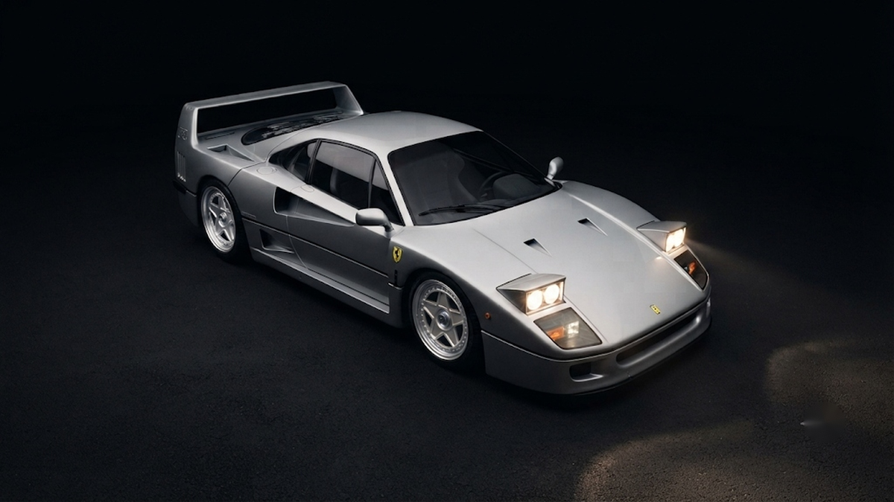

# 🏎️ Omarchy Silver Phantom

> **Pure Silver-Black Dual-Tone Stealth Showroom Theme for Omarchy Linux.**  
> Designed by **[@arsh240311](https://github.com/arsh240311)**.



---

## 💎 The Philosophy: Zero RGB. Pure Titanium Elegance.

Most desktop themes rely on busy rainbow palettes that cause optical fatigue. **Silver Phantom** eliminates all noise in favor of an executive, high-contrast **dual-tone monochrome luxury aesthetic**:
- **Base Canvas:** Pitch Obsidian Void (`#090a0f`)
- **Metal Accents:** Liquid Titanium & Chrome Silver (`#d8dbe6`)
- **Artwork:** Studio-lit Ferrari F40 with illuminated pop-up headlights resting on a seamless non-reflective matte asphalt floor.

---

## 📦 What's Included

| Component | Description |
|---|---|
| **`colors.toml`** | 26-token dual-tone grayscale palette generating unified terminal & desktop colors. |
| **`hyprland.conf`** | Razor-thin silver active window borders (`rgba(e6e8f2cc)`) with deep 16px obsidian shadows. |
| **`btop.theme`** | Pure titanium grayscale system monitors with liquid silver usage bars. |
| **`gtk-3.0` & `gtk-4.0`** | Native pitch-black dark mode window chrome and dialog styling. |
| **`walker.css`** | Minimalist floating spotlight application launcher. |
| **`cava_theme`** | 6-tier titanium-to-white audio spectrum visualizer. |
| **`unlock.png` & `shell.lock.toml`** | Native lockscreen styling under **Style > Unlock**. |

---

## 🚀 Quick Install (Omarchy Linux)

Open your terminal and run:

```bash
omarchy theme install arsh240311/omarchy-silver-phantom
```

Then switch your theme via **`Super + Alt + Space` (Menu) ➔ Style ➔ Themes ➔ Silver Phantom**!
